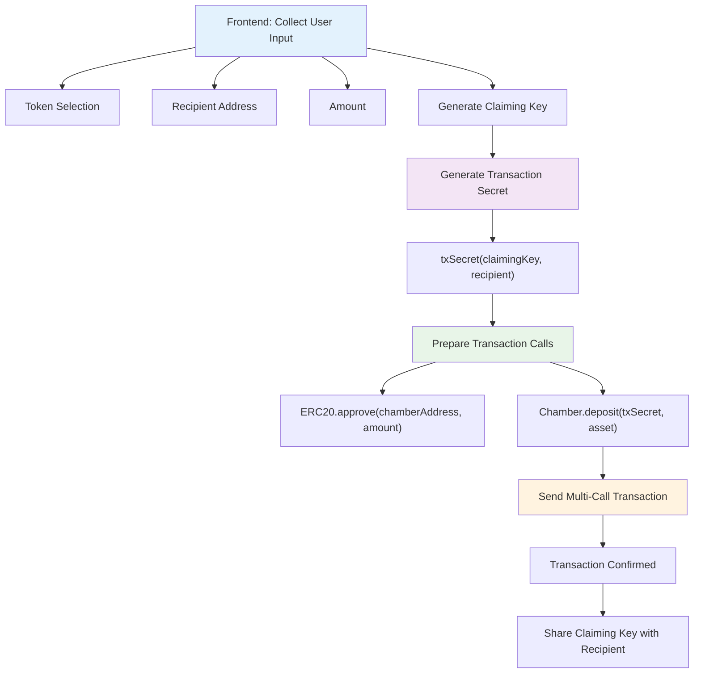
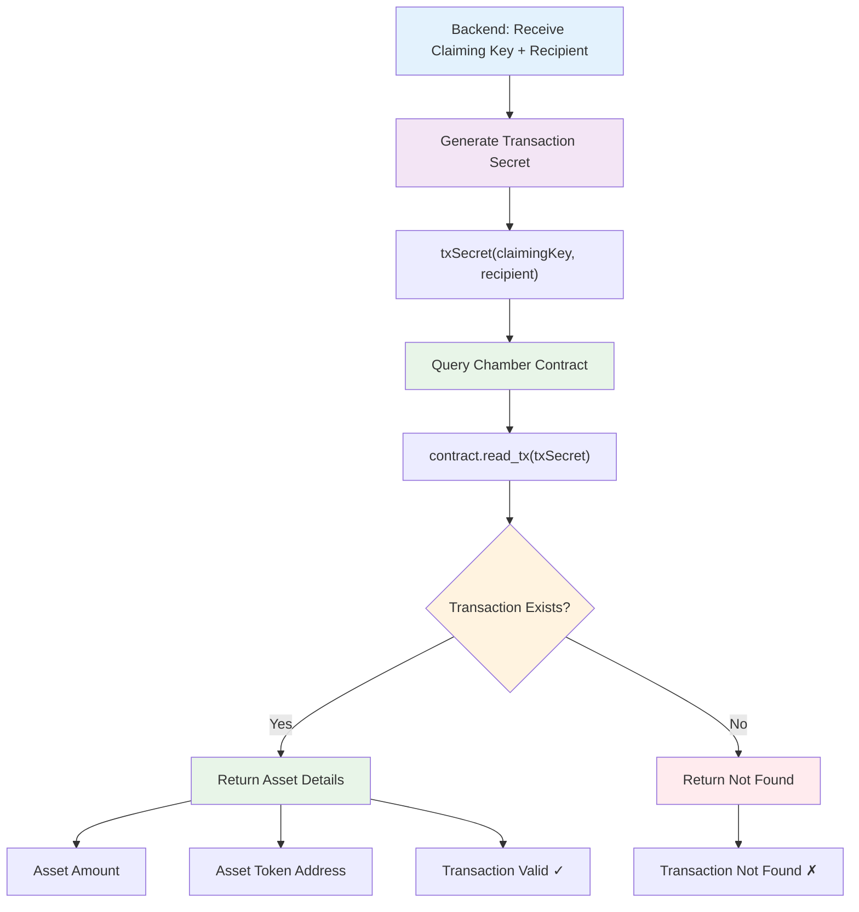

# MIST.cash workflows

### ⚠️ This section is under review, might need updates and is provided as-is.

## 1. Submit Transaction Flow



### Code Example

```typescript
import { useMist } from '@mistcash/react';
import { txSecret } from '@mistcash/crypto';
import { uint256 } from 'starknet';

// In your React component
async function submitTransaction(
  claimingKey: string,
  recipient: string,
  tokenAddr: string,
  amount: bigint,
) {
  // Generate transaction secret
  const txSecret = await txSecret(claimingKey, recipient);
  const amount = uint256.bnToUint256(amount_bi);
  erc20.address = selectedToken;
  const asset = {
    amount,
    addr: selectedToken,
  };

  // Prepare calls
  const calls = [
    erc20Contract.populate('approve', [chamberAddress, uint256.bnToUint256(amount)]),
    contract.populate('deposit', [uint256.bnToUint256(txSecret), asset]),
  ];

  // Send transaction
  send(calls);
}
```

---

## 2. Verify Transaction Flow



### Code Example

```typescript
import { getChamber, fetchTxAssets } from '@mistcash/sdk';
import { txSecret } from '@mistcash/crypto';

// Backend verification function
async function verifyTransaction(claimingKey: string, recipient: string) {
  const contract = getChamber(provider);

  try {
    // Method 1: Direct read (faster)
    const secret = await txSecret(claimingKey, recipient);
    const asset = await contract.read_tx(secret);

    if (asset.amount > 0) {
      return {
        found: true,
        amount: asset.amount,
        tokenAddress: asset.addr,
      };
    }

    return { found: false };
  } catch (error) {
    // Method 2: Fetch from transaction array (more reliable)
    const assets = await fetchTxAssets(contract, claimingKey, recipient);

    return assets.length > 0
      ? {
          found: true,
          amount: assets[0].amount,
          tokenAddress: assets[0].addr,
        }
      : { found: false };
  }
}
```
